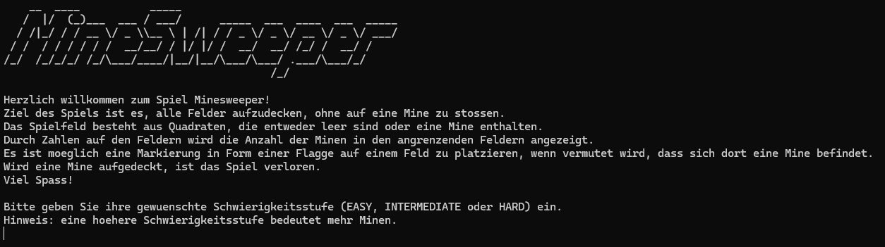
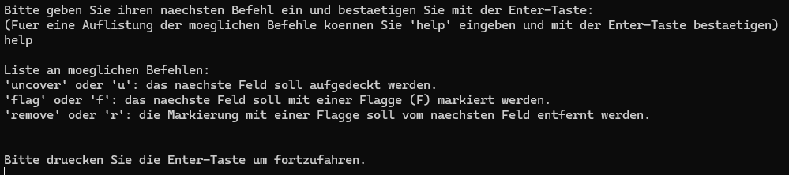
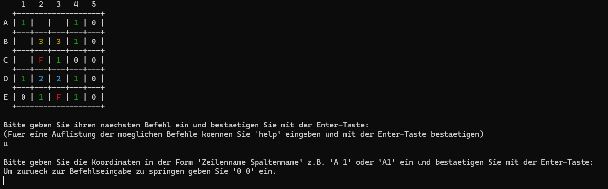
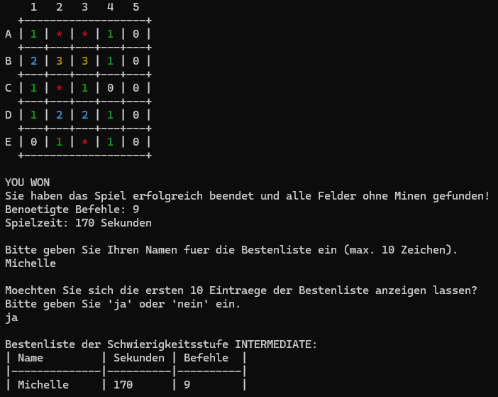

# Minesweeper (C) 🎮

Console-based Minesweeper game developed as part of a **team project** at university.  
Primary contributions include the main game logic, while collaborating on shared components and headers.

---

## System Requirements

- Tested on systems with a C compiler (Windows & MacOS).  
- Ensure a C compiler like **GCC** is installed.

---

## Compiling the Program

1. Open a terminal or command prompt.  
2. Navigate to the folder containing the Minesweeper source files (`main.c`, `leaderboard.c`, `readandinput.c`, `mines.c`, `printf.c`, `gameloop.c`, `init.c`).  
3. Compile the program:

```bash
gcc -c init.c gameloop.c mines.c printf.c readandinput.c leaderboard.c -Wall -Wextra -ansi -pedantic
gcc main.c leaderboard.o readandinput.o mines.o printf.o gameloop.o init.o -o minesweeper -Wall -Wextra -ansi -pedantic
```

---

## Running the Program
- After compiling, run the program with optional height and width parameters:
  
MacOS:
```bash
./minesweeper [height] [width]
```
Windows:
```bash
minesweeper [height] [width]
```
- Without parameters or invalid input, default or maximum size is used.
- The program starts with a welcome message and gameplay instructions.

---

## Gameplay Instructions
- The grid is represented by coordinates (rows and columns).
- Choose a difficulty level: EASY, INTERMEDIATE, HARD.
- Follow program prompts (the game outputs instructions and messages in **German**) to uncover fields, set/remove flags.
- Use help or h to see all available commands.
- Input coordinates to play or 0 0 to return to the previous menu.
- Avoid uncovering mines. Hitting a mine ends the game.
- The game is won when all non-mine fields are revealed.
- After finishing, you can view the leaderboard (if available).

---

## Commands

| Command        | Action                            |
|----------------|----------------------------------|
| `uncover` / `u` | Uncover a field                  |
| `flag` / `f`    | Place a flag on a field           |
| `remove` / `r`  | Remove a flag from a field        |
| `help` / `h`    | Show available commands           |

---

## Leaderboard

- Saved as a `.txt` file when a player wins.  
- If no winners exist yet, viewing the leaderboard may show an error.  

---

## Tech Stack

- **Language:** C (C89 standard)
- **Compiler:** GCC  
- **Platform:** Windows & MacOS

---

## Notes

- Designed as a console-based project to demonstrate **fundamentals of C programming, file I/O, and game logic**.  
- Developed as part of a team project

---

## Screenshots






